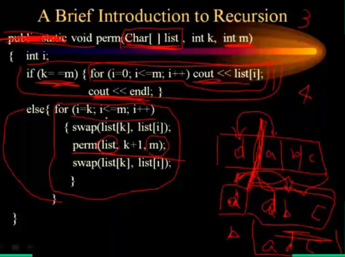

# 数据结构与算法

## 8.31

> ###  Data definition：

is the carrier of information

Data is a set of numbers, characters and other symbols.

#### 	Data type

​		-is a set of values together with a operation set that operate on these values.

​		-大部分编程语言提供两种预定义的数据类型

​			-Atom data type ---- int, float, double......

​			-Structure data type ---- array, struct......

> ### What is Data Structure

a data structure is a data object(D) together with the relationships(R) among the data members that compose the object.

## 9.2

> ### ADT and OO

#### ADTs:

​	Abstract Data Types

​	是将类型和与这个类型有关的操作集合封装在一起的数据模型。

​		-Abstract: is a method used to hide the information.

​		-思想：将数据类型的使用与它的表示（机内存储）、实现（机内操作的实现）分开。更确切的

​		说，把一个数据类型的**表示**及在这个类型上的操作**实现**封装到一个程序模块中，用户不必知道他

#### OO:

​	object-oriented = object + class + inherit + communicate

​		-object: attribute values + operates

> ### Algorithm definition

#### Algorithm :

​	an operation sequence of soluting a problem

#### Properties:

​	-Input specified

​	-Output specified (算法是有输入和输出的)

​	-Definiteness (确定性、定性的，每一个算法都必须定义的很明确、书上的概念)（考研题考过）/ Deterministic（确定性算法，是算法的分类，算法包括deterministic和nondeterministic）

-确定性算法：对于一个固定的输入，算法有一个固定的输出

​	-Effectiveness

​	-Finiteness (有穷性)

> ### 算法思想

#### 1.Inducive

basis:

inducive condition:

inducive proof:

Q.E.D.

#### 2. Recursive 

​	C语言不断调用函数就是不断压栈的过程，每调用一个新函数则新创建一个栈空间

​	调用构成回路即构成递归!

​		eg: $f_1 -> f_2 -> f_3 -> f_1$

​	-牺牲执行效率，提高开发效率

​	$eg_1$ 全排列算法:

m是数组最后一个元素的下标, k是把数组分为两个部分的指标。

递归到m-1个元素的全排列和m个元素全排列的递推关系。

用循环找递推关系：每次把单独拿出来的元素跟后面全排列中的某一个元素交换顺序。

#### 2.运行时和编译

运行时（.exe)和编译是完全不同的两个概念

​	-应用举例: 运行时才能确定变量的大小, 所以编译时, 如果用变量作为数组的长度, 编译器无法确定数组的	大小, 从而报错!

​	In C++, the compiler must know the amount of memory to allocate for an array at compile time. However, the value of a variable is not known until run time. This is why you are not allowed to use a variable for the size of an array.

## 9.14

this在Java里对象的引用，在C++里是一个指针

> ### Generic Objects in Java

对于仅仅是参数数据类型不同的方法，可以使用“泛型”

## 9.17

### Space Complexity

​	-$S_{(n)}$

​	-指令空间

​	-数据空间

​	-栈空间

主要看运行时的动态占用空间

### Time Complexity

​	-$T_{(p)}$

​	本质上是CPU的工作量

​	

​	编译时间一般不算算法的时间复杂度

​	算时间复杂度也是粗略的算一下，只算主要消耗时间的步骤
