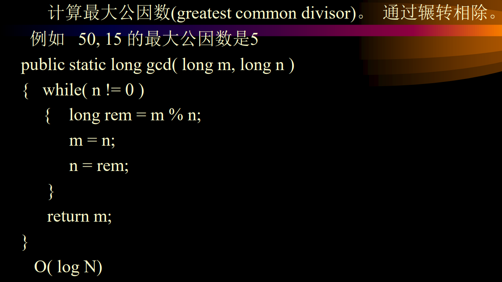
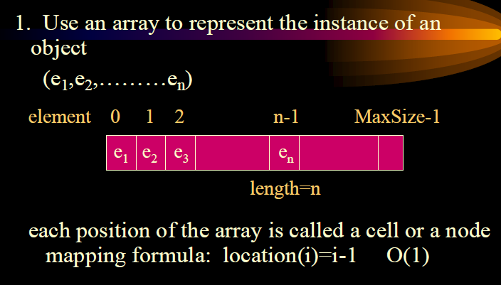
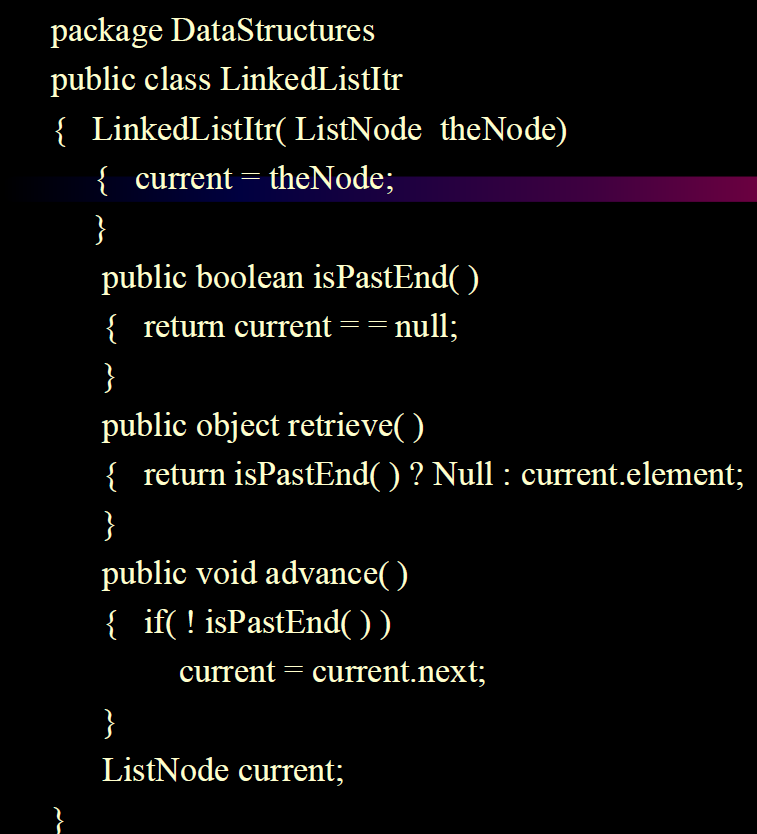

# 数据结构与算法

## chapter1、Data and Algorithm

> ###  Data definition：

is the carrier of information

Data is a set of numbers, characters and other symbols.

#### 	Data type

​		-is a set of values together with a operation set that operate on these values.

​		-大部分编程语言提供两种预定义的数据类型

​			-Atom data type ---- int, float, double......

​			-Structure data type ---- array, struct......

> ### What is Data Structure

a data structure is a data object(D) together with the relationships(R) among the data members that compose the object.


> ### ADT and OO

#### ADTs:

​	Abstract Data Types

​	是将类型和与这个类型有关的操作集合封装在一起的数据模型。

​		-Abstract: is a method used to hide the information.

​		-思想：将数据类型的使用与它的表示（机内存储）、实现（机内操作的实现）分开。更确切的

​		说，把一个数据类型的**表示**及在这个类型上的操作**实现**封装到一个程序模块中，用户不必知道他

#### OO:

​	object-oriented = object + class + inherit + communicate

​		-object: attribute values + operates

> ### Algorithm definition

#### Algorithm :

​	an operation sequence of soluting a problem

#### Properties:

​	-Input specified

​	-Output specified (算法是有输入和输出的)

​	-Definiteness (确定性、定性的，每一个算法都必须定义的很明确、书上的概念)（考研题考过）/ Deterministic（确定性算法，是算法的分类，算法包括deterministic和nondeterministic）

-确定性算法：对于一个固定的输入，算法有一个固定的输出

​	-Effectiveness

​	-Finiteness (有穷性)

> ### 算法思想

#### 1.Inducive

basis:

inducive condition:

inducive proof:

Q.E.D.

#### 2. Recursive 

​	C语言不断调用函数就是不断压栈的过程，每调用一个新函数则新创建一个栈空间

​	调用构成回路即构成递归!

​		eg: $f_1 -> f_2 -> f_3 -> f_1$

​	-牺牲执行效率，提高开发效率

​	$eg_1$ 全排列算法:


m是数组最后一个元素的下标, k是把数组分为两个部分的指标。

递归到m-1个元素的全排列和m个元素全排列的递推关系。

用循环找递推关系：每次把单独拿出来的元素跟后面全排列中的某一个元素交换顺序。

#### 2.运行时和编译

运行时（.exe)和编译是完全不同的两个概念

​	-应用举例: 运行时才能确定变量的大小, 所以编译时, 如果用变量作为数组的长度, 编译器无法确定数组的	大小, 从而报错!

​	In C++, the compiler must know the amount of memory to allocate for an array at compile time. However, the value of a variable is not known until run time. This is why you are not allowed to use a variable for the size of an array.


this在Java里对象的引用，在C++里是一个指针

> ### Generic Objects in Java

对于仅仅是参数数据类型不同的方法，可以使用“泛型”

## chapter2、complexity

### Space Complexity

​	-$S_{(n)}$

​	-指令空间

​	-数据空间

​	-栈空间


主要看运行时的动态占用空间

### Time Complexity

​	-$T_{(p)}$

​	本质上是CPU的工作量

​	

​	编译时间一般不算算法的时间复杂度

​	算时间复杂度也是粗略的算一下，只算主要消耗时间的步骤


### Rank sort（秩排序）

​	先把数组里每个数的排名得到，然后再根据排名进行排序、调整


生成排名算法：


二重循环保证每两个数据都能比一次，两两比，一旦比过了rank++；


这个循环的目的是保证r[i] == i

### Sequential Search（顺序查找）


最坏情况：比较次数是n

平均情况：每种情况的概率加起来求算术平均


### Insertion sort（插入排序）


边比边调整数组，随时为x（待插入元素）腾出位置，最终直接插入

完整实现：

双重循环，最外层循环每次加一个a[i]


### 渐进时间复杂度


$O(0)<O(log_2n) < O(n) < O(2^n) < O(n!) < O(n^n)$

批注：计算机中对数默认为2

​				$O(0)$表示常数复杂度

做算法复杂度分析的时候**关注量级**


### Binary Search（折半查找）

可以把顺序查找的线性复杂度降为对数复杂度

把每次的数据和中间的数据比（前提是数据库是已经分好类的）


### 找最大子序列和

使用三重循环找到所有子序列，然后用一个标志位maxSum来记录最大子序列的和

优化1：只使用两重循环，第一层循环i定起点，第二层循环j定终点，然后每次加一个新元素只是在原有和的基础上加一个元素


### 算法思想：分治法

分：把问题分成两个大致相等的问题，使用递归等方法找到他们的解

治：把二者合并在一起，并通过一些附加工作得到答案

以找最大子序列的问题为例：把数列分为两半，先找两边的最大子序列，然后再从中间出发，找左右两边起点/终点固定的最大子序列，二者拼起来和左右两边的最大子序列比较

**注1：分治法通常是跟递归一起使用的，以此题为例，即：每次求左右两边结果的时候同样要使			 用分治法**

**注2：递归更多的是使用递推公式，而分治法则是平均二分**


看起来，好像算递归/分治算法的复杂度是看每次栈的复杂度 * 栈数

由此分析出分治法找最大子序列和的时间复杂度是$O(n * log_2n)$ [经计算，每次调用栈的复杂度正好都是n]


### Euclid's Algorithm（辗转相除法）



**算法思想：**

m -> n -> m % n -> n % (m % n) -> ...不停往后走一格

- eg： 30 7 -> 2 -> 1 -> 结束，最大公因数是1
- 首先明确：此算法的最坏情况是m和n互素，这样m和n相除的轮数尽可能多
- 然后从tail开始分析，为保证辗转相除的次数尽可能大，要保证在同等规模除的情况下，数据尽可能的小，因此：
  -  ... 13 -> 8 -> 5 -> 3 -> 2 -> 1（tail）
  - 正好是斐波那契数列
  - 比如要得到1000以内辗转相除法的最大迭代次数，即取1000以内最大的相邻两项斐波那契额数列，此时迭代次数即为斐波那契数列的项数 - 3
  - 斐波那契数列是对数量级的（可以用数列的递推公式来推导）
    - 因此此算法$O(f(n)) = O(logN)$


### $O(n)\ and\ Ω(n)$

- 课本P33 
- $o(n)$跟$O(n)$都表示最坏情况复杂度，但是$o(n)$表示算法无法达到该理论最坏复杂度


## chapter3、LinearList

### Set & Collection的区别

- Set强调元素只出现一次，而Collection无此要求
- Java里，Collection是List`, `Queue`, `Deque的父类，以它为接口可以提供更多多态选择
- Collection includes Set, as well as List.


### The List ADT

- 课本P43

- 线性表存在第一个元素和最后一个元素

- 每个元素由一维下标组成
- 除了首尾，每个元素有后继和前序


### Simple array implementation of Lists

- use an array to represent the instance of an object
- 


- PS：***ACN*** ： average comparison number
- 讲逻辑层的时候，下标起点为1；而讲物理层时，下标起点为0
- $remove(): O(n)$
- $insert(): O(n)$
- PS：***AMN*** ： average movement number
- **Merit:** easy search
- **Shortcoming:** insertion and deletion spend a lot of time


### Linked Lists

- 逻辑层和数组List一模一样，但是物理实现是通过单向链表实现的
- 删除首结点，Java和cpp操作不一样
- Java
- 而cpp要把first = first.next; delete[] first;
- 删除中间节点，需要before指针指向删除结点的前一个结点。Java仍然只需要一句代码
- 

#### 带表头结点的链表Header（dummy node）

- 
- 从第二个结点才开始存放数据
- header结点的数据区不放东西


- 默认的单链表是不带表头的单链表

#### Java中关于单链表的实现

- Class definition
  - ListNode —— 代表结点的类
  - LinkedList —— 代表表本身的类
  - LinkedListItr —— 代表位置的类（游标类，指向当前位置的引用/指针）
  - 以上都是包DataStructures的一部分




- 此处认链表是带头节点的单链表


#### 相关操作复杂度

- 数据查找 find - O（n）
- 删除结点 delete - O（1）
- 插入结点 insert - O（1）


#### 线性链表的其他变形

- 双向链表（doubly linked list）

- 循环链表


#### Josephus问题

- 使用循环单链表，依次计数，然后每次删去第m个结点并打印该结点编号，当只剩下一个结点的时候结束算法

```c++
void Josephus(CircList<T>& Js, int num, int count){
    //the first param points to the first node of Js
    CircList<T> *p = Js.Locate(1), *pre = NULL;
    for(int i = 0; i < num - 1; i++){
        //count n-1 times, eventually remain one person.
        for(int j = 1; j < count; j++){
            //find the to be killed person.
            pre = p;
            p = p -> next;
        }
        //print message.
        cout << "The person to be killed is " << p -> data << endl;
        //delete the node.
        pre -> next = p -> next;
        //update the head pointer.
        if(first == p) first = p -> next;
        delete p;
        //important step! ensure next loop of program can run!
        p = pre -> next;
    }
    cout << "Eventually "<< first -> data << " survived!" << endl;
}
```

