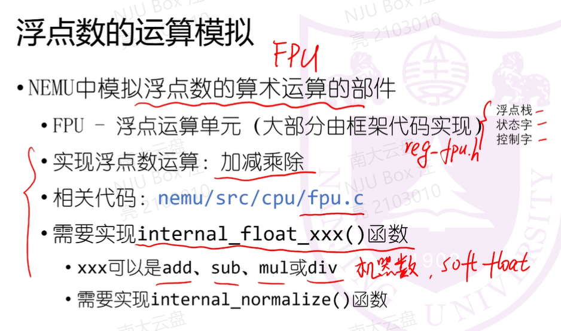

# PA课笔记

## 		PA_1-1

把reg.h中的上面三个struct改为union即可

​	注意：在每次改完头文件或者配置文件之后，都要make clean一下

## 	PA_1-2

​	-对于ADC的CF：分为CF=0或CF=1两种情况判断（此处参与运算的CF是上一条指令留下的CF，然后ADC再重新设置CF）

不过CF=1的时候需要额外考虑一种情形：res = src的时候也产生进位（此时des = 0xFFF...）

其余情况看res < src?即可

​	-对于SUB，可以取减数的补码做加法，此时不能按照加法的逻辑判CF，因为减法是在表盘上逆时针运算。

## PA_1-3

4-3可能还会碰到没有实现的浮点数指令，则需要看网站自己实现

以32位单精度的IEEE 754为目标模拟

不带隐藏位的尾数：fraction

带隐藏位的尾数：significand

结构体里，写在上面的是低地址部分

在机器数的基础上，实现浮点数的相关运算

注意：函数传进来的参数是机器数！

