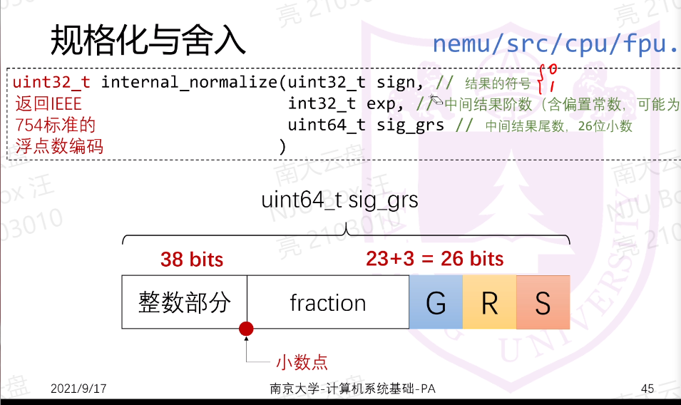
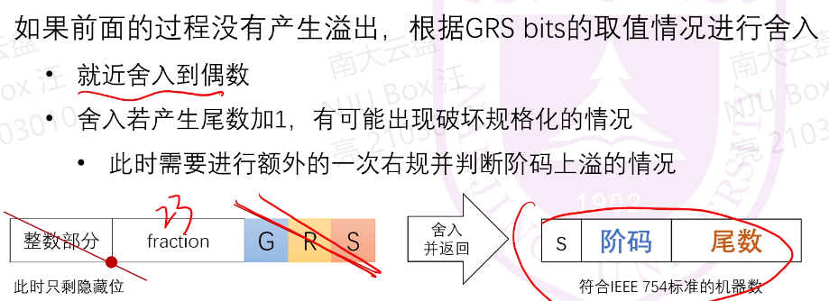

# PA课笔记

## 		PA_1-1

把reg.h中的上面三个struct改为union即可

​	注意：在每次改完头文件或者配置文件之后，都要make clean一下

## 	PA_1-2

​	-对于ADC的CF：分为CF=0或CF=1两种情况判断（此处参与运算的CF是上一条指令留下的CF，然后ADC再重新设置CF）

不过CF=1的时候需要额外考虑一种情形：res = src的时候也产生进位（此时des = 0xFFF...）

其余情况看res < src?即可

​	-对于SUB，可以取减数的补码做加法，此时不能按照加法的逻辑判CF，因为减法是在表盘上逆时针运算。

## PA_1-3

4-3可能还会碰到没有实现的浮点数指令，则需要看网站自己实现

以32位单精度的IEEE 754为目标模拟

不带隐藏位的尾数：fraction

带隐藏位的尾数：significand

结构体里，写在上面的是低地址部分

在机器数的基础上，实现浮点数的相关运算

注意：函数传进来的参数是机器数！

框架代码已经处理好了所有的边界情况，包括NaN、0、INF

也就是说我们在处理浮点数的时候只需要判断非规划化数和规格化数即可。

位或：| = 目的是加上implided bit

### 浮点数做加减法的步骤：

1. 对阶：小阶向大阶看齐

   小阶增加至大阶，同时尾数右移，保证对应真值不变

   但是注意此处要考虑非规格化数的情形

2. 尾数相加（相减）

同时要加入保护位G、R、S，因此此时尾数有23 + 3 = 26位

注意：sticky（粘位）表示的是在它更低的位置是否有1，一旦有1出现，就被黏住。

即一旦有1被移出了s，s就永远为1

得到中间结果后进行规格化和舍入操作，得到符合IEEE 754标准的数字

乘除法可能出现结果为负的阶码

### 规格化

两步：先转化为1.xxxx * 阶码的操作（右规or左规），再砍掉grs

如果exp加过了头，令exp = 0xFF，尾数 = 0（在IEEE 754中表示INF）

注：除了考虑规格化数变为非规格化数，还要考虑非规格化数变为规格化数

### 舍入

