# PA课笔记

## 		PA_1-1

把reg.h中的上面三个struct改为union即可

​	注意：在每次改完头文件或者配置文件之后，都要make clean一下

## 	PA_1-2

​	-对于ADC的CF：分为CF=0或CF=1两种情况判断（此处参与运算的CF是上一条指令留下的CF，然后ADC再重新设置CF）

不过CF=1的时候需要额外考虑一种情形：res = src的时候也产生进位（此时des = 0xFFF...）

其余情况看res < src?即可

​	-对于SUB，可以取减数的补码做加法，此时不能按照加法的逻辑判CF，因为减法是在表盘上逆时针运算。

## PA_1-3

4-3可能还会碰到没有实现的浮点数指令，则需要看网站自己实现

以32位单精度的IEEE 754为目标模拟

不带隐藏位的尾数：fraction

带隐藏位的尾数：significand

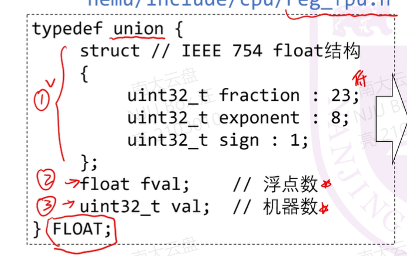

结构体里，写在上面的是低地址部分

在机器数的基础上，实现浮点数的相关运算

注意：函数传进来的参数是机器数！

框架代码已经处理好了所有的边界情况，包括NaN、0、INF

也就是说我们在处理浮点数的时候只需要判断非规划化数和规格化数即可。

位或：| = 目的是加上implided bit

### 浮点数做加减法的步骤：

1. 对阶：小阶向大阶看齐

   小阶增加至大阶，同时尾数右移，保证对应真值不变

   但是注意此处要考虑非规格化数的情形

2. 尾数相加（相减）

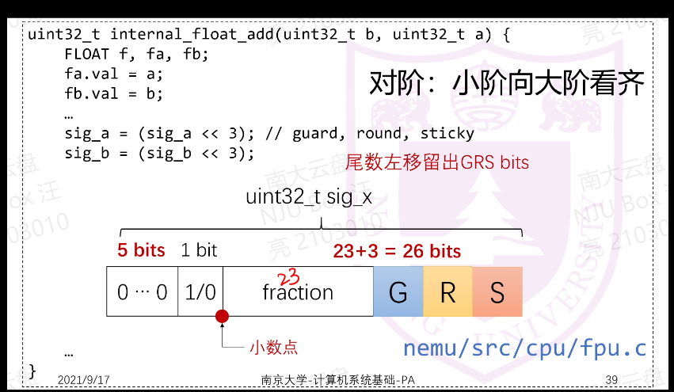

同时要加入保护位G、R、S，因此此时尾数有23 + 3 = 26位

注意：sticky（粘位）表示的是在它更低的位置是否有1，一旦有1出现，就被黏住。

即一旦有1被移出了s，s就永远为1

得到中间结果后进行规格化和舍入操作，得到符合IEEE 754标准的数字

乘除法可能出现结果为负的阶码

### 规格化

两步：先转化为1.xxxx * 阶码的操作（右规or左规），再砍掉grs

如果exp加过了头，令exp = 0xFF，尾数 = 0（在IEEE 754中表示INF）

注：除了考虑规格化数变为非规格化数，还要考虑非规格化数变为规格化数

### 舍入

## PA_2-0

game kernel testcase 都是软件

nemu 为模拟计算机

注： 反斜杠的意思是换行

***gcc -o hello_world hello_world.c 一条命令执行了四个步骤***：

### .i  预处理 Proprocess 

- gcc -E -o（表示指定输出） add.i add.c : 表示对.c文件进行预处理

- 展开#inlclude头文件的内容【把头文件内容拷贝到.i文件中】
- 展开宏定义【把源程序（.c）文件中的宏语句替换成宏定义】

### .S 编译 Compile

- gcc -S -o add.S add.i
- 编译是把C语言翻译成汇编语言
- 比较困难

### -c 汇编 Assemble

- 将汇编语言转变成机器语言程序（.o文件）
- 如果想查看 -o 文件，则需要用objdump反汇编工具进行查看
  - objdump4nemu-i386 -d（表示做反汇编） add.o > add.obj
- 比较简单
- gcc -c

### 链接 link

### Hello World 汇编程序示例

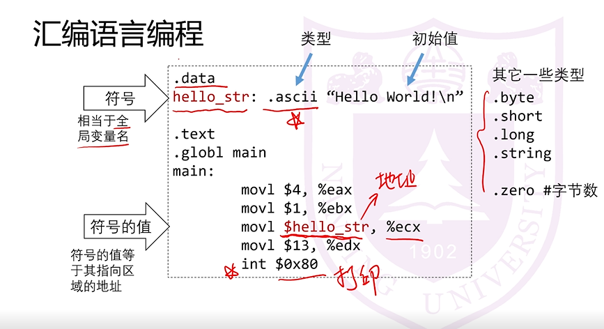

hello_str前面加$符号表示该变量的地址

程序的入口就是.globl main -- 链接器需要它

### 汇编语言的格式

​	gcc接受的格式，也是我们写程序采用的格式

#### AT&T格式（objdump显示的格式）：

#### INTEL格式（i386手册上采用的格式）

- 注意：中间有逗号
- AT&T是小写，INTEL是大写

#### 长度后缀

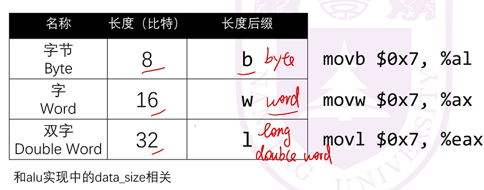

#### 操作数寻址

- 课本P93 

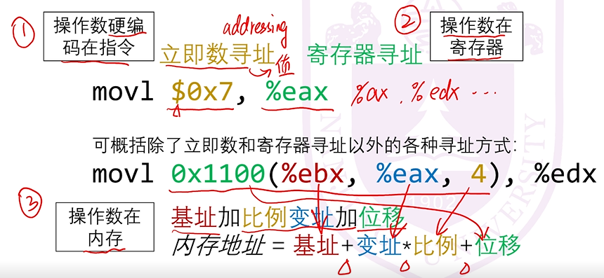

- 如果操作数在内存中，数字前面是没有$的

#### 一个小练习

- 在内存里面求解斐波那契

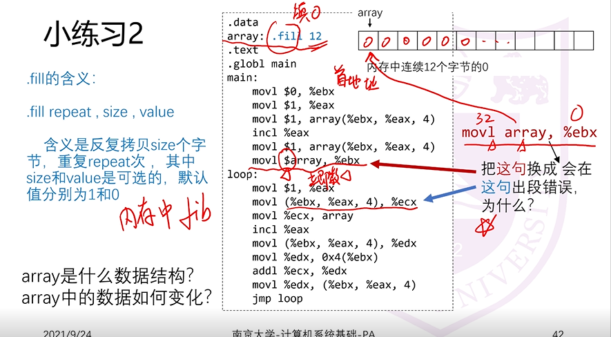

### 使用gdb调试程序

- 调试某程序：gdb <程序名> 
  - eg: gbd nemu
- 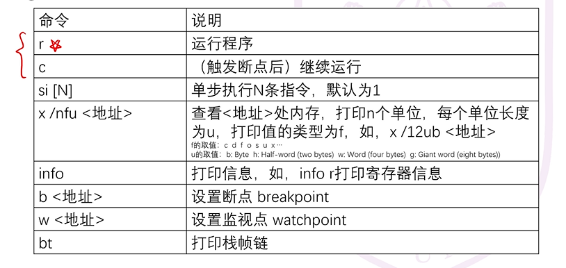
- q （quit）退出

#### 使用monitor（nemu内置调试器）调试程序

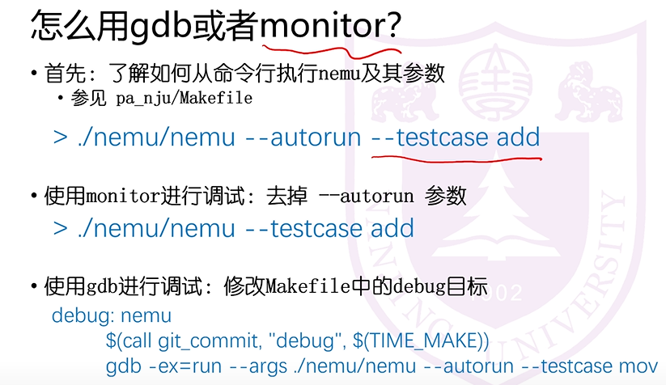

- 也可以用gdb直接调试nemu，调用make debug
  - 见PA_2-0 录播 最后10分钟示例

## PA_2-1

### 大致探讨

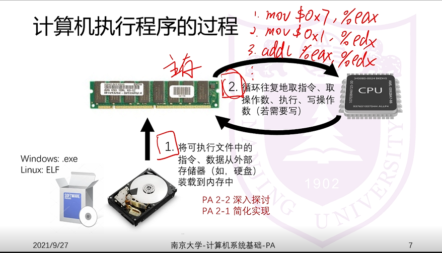

第一步：装载（2-1简单实现，2-2深入探讨）

- EIP寄存器即为PC， 装载时初始化为0x300000
- ESP寄存器即为当前的栈顶，指向内存的末尾0x7FFFFFF
  - 栈是从高地址向低地址涨

第二步：执行指令

- 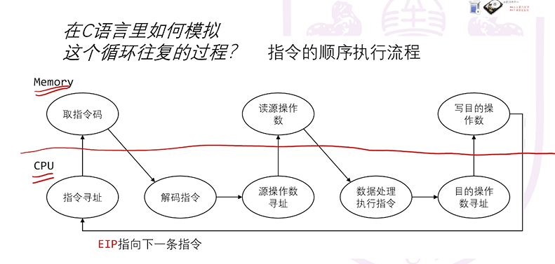

- 循环图的起点是“指令寻址” ---- 得到指令的内存地址
- 然后到内存里取指令码
- 再解码指令，把二进制翻译成指令
- 寻址源操作数
- ...

### 如何用C语言来模拟该循环往复的过程呢？

- while循环模拟

- 单条指令执行的函数

exec函数的入口在single_run函数的ui_mainloop函数中

exec函数的关键是exec_inst函数

- exec_inst函数

instr_fetch本质是调用memory.vaddr_read()函数，读内存

### 怎么知道opcode对应哪条指令呢？/ 单条指令的解码

- 查手册
- 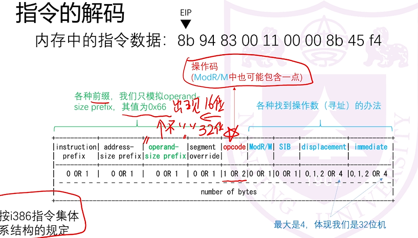
- opcode分为往左看和往右看，如👆图

### 指令的解码过程

- 从EIP指向的字节开始看，先看是不是0x66，也不是0x0F，若不是，操作数32位，0x8b为操作码
- 查i386手册
  - 
  - 即为MOV Gv Ev（Ev是src， Gv是dest）
  - G、E、v的具体含义参阅i386手册
- 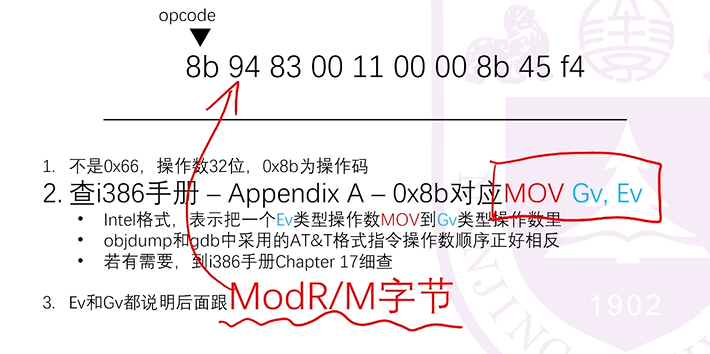
  - ModR/M字节（8位）具体解析
    - 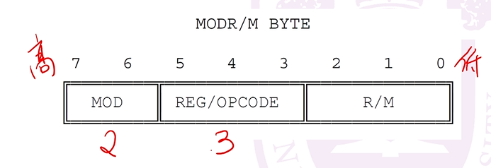
    - 由前一个opcode决定中间3位是reg还是opcode。根据Gv的解释，中间三位取reg

- 再看下一个字节，然后查i386表，可以知道displacement（disp）是否存在
  - 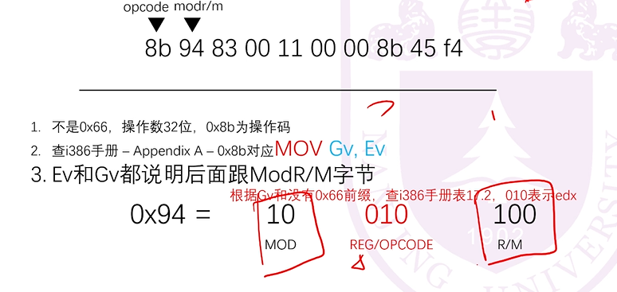
  - 寄存器有方括号表示内存地址寻址，否则表示寄存器寻址
  - [--] [--]
    - 
    - SIB字节结构
    - 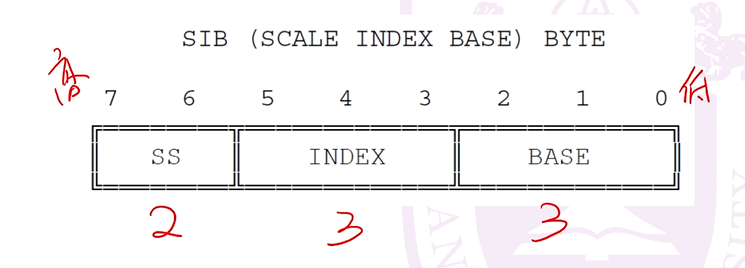

PS：gpr表示通用寄存器

- 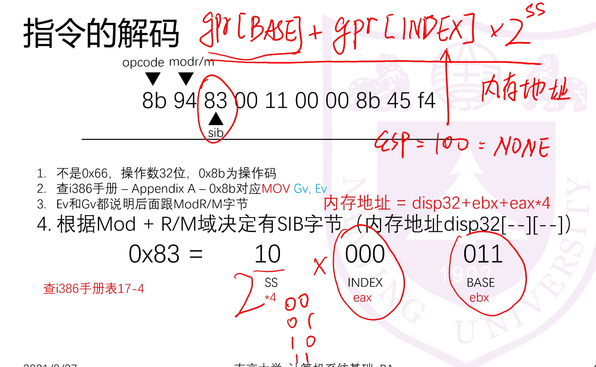	

Sib寻址方式就类似于在数组型数据结构里寻址，数组的首地址放在base里，元素下标放在index中，而$2^{ss}$即为$sizeof(ADT)$

- 解析完成

- 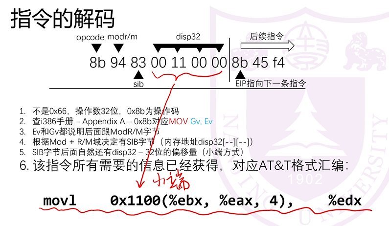
- 无0x66知道的mov后缀为l
- reg field知道dest是%edx
- sib和modr/m知道中间的src及运算方式

有时还会遇到grp（group）指令

找到groupx， 然后根据modR/M的中间三位来区分group中是哪条的。

opcode的解码：

- 直接在数组里面取
- 双字节操作码
- group操作码

注：i：立即数；rm：register/memory

#### 模拟mov指令函数

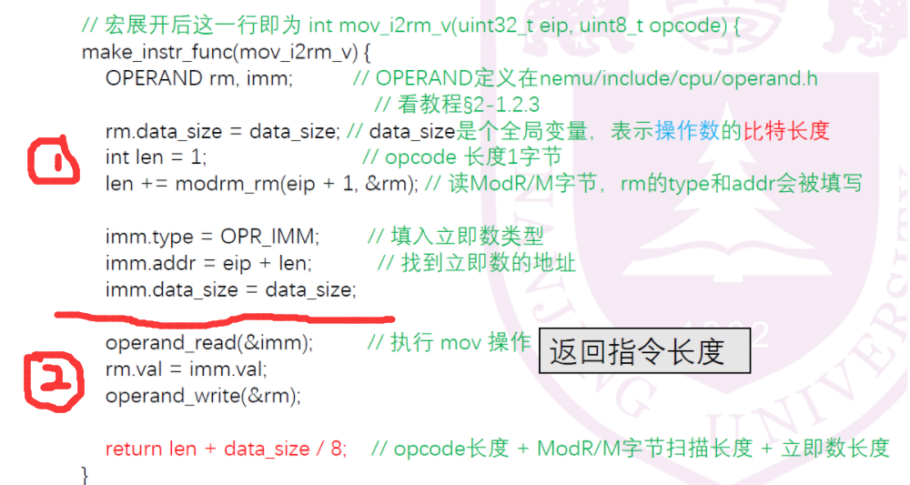

其实之后的函数也大同小异

比如说如果模拟add 的话，只需要改②块的代码（调用alu.add，并用r/m.val接受返回值 )

## PA_2-2

### ELF文件概述

针对UNIX和类UNIX系统而言

.o和不带后缀的文件是ELF文件

### ELF文件的结构

ELF头中定义了节头表和程序头表的位置，然后找到它们，它们里面又定义了对应节地址和装载规范

而程序头表（program headers）里，可执行文件才有程序头表，否则（如可重定位文件，.o后缀）没有

其中，节头表（Section Headers）里，.text和.data两个节比较重要，分别存放指令和初始化的全局变量及静态变量

### ELF文件的装载

描述的文件的哪一节（Section）装载到内存的哪一部分（Segment）

### Kenerl的引入

实际上，ELF文件的装载是由操作系统（Kernel）完成的，所以事先要把Kenerl装载到内存中，然后由Kenerl完成装载。

- 在本课程中，软件可以简单得定义成指令的序列
- Kernel中的eip是临时定义的局部变量，而不是nemu中的cpu.eip

