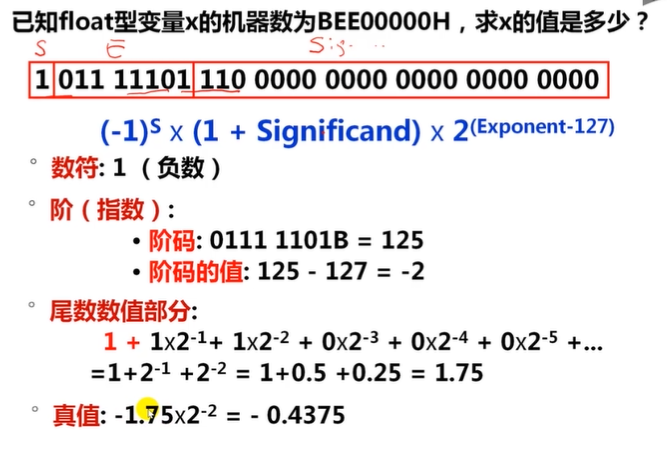
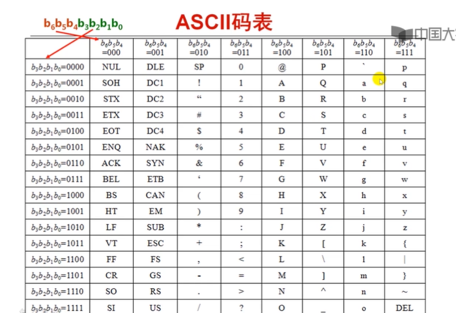
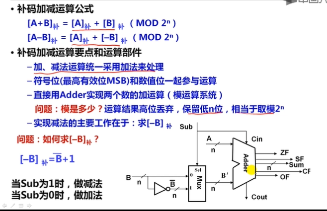
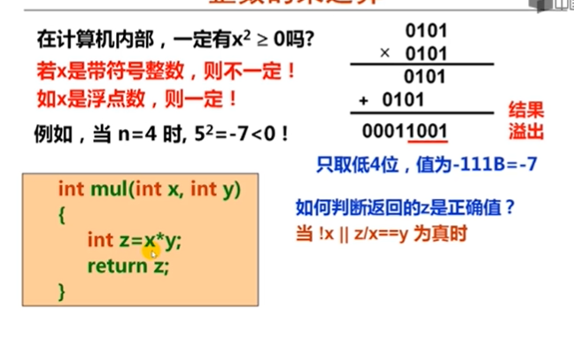
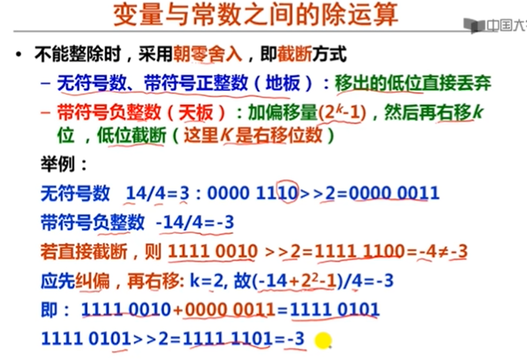
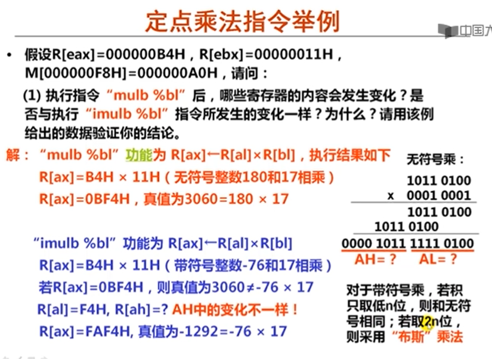
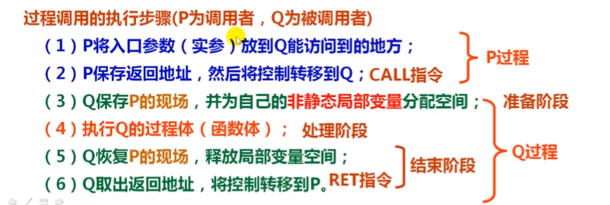
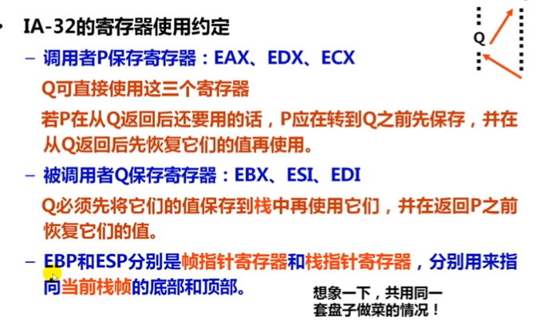
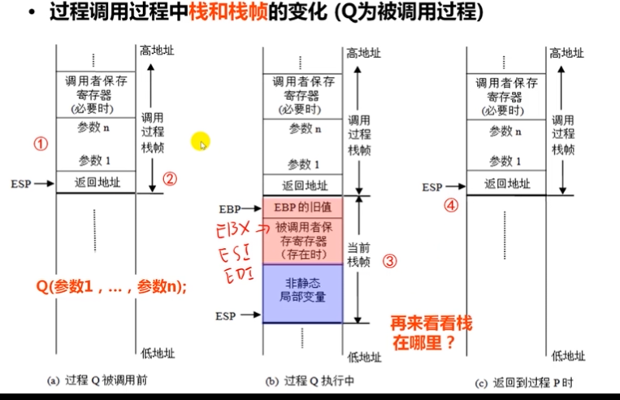

# 计算机系统基础

## 8.30 第一章

比特b：0或1

字节B：8比特（0xFF）

在**intel i386**

字   ： 2个字节

双字：4个字节

#### 小端：

低有效字节在低地址

#### 大端：

低有效字节在高地址

ps：本次pa是以小端方式存储

## 9.5 第一章

计算机系统的性能评价主要考虑的是CPU性能。

### CPU性能

​	-用户CPU时间，即CPU运行用户程序代码的时间

### 时钟周期

​	-计算机执行一条指令需要分为若干个微操作，而为了同步这些微操作的控制信号，计算机必须产生同步的时钟定时信号，即**CPU的主脉冲信号**，其宽度成为时钟周期


​	-时钟频率：CPU的**主频**就是CPU的主脉冲信号的时钟频率，是CPU时钟周期的倒数


### CPI

cycles per instruction

​	-表示执行一条指令所需的时钟周期数。

​	用户CPU时间 = CPI  * 程序总指令条数 * 时间周期

​	两台计算机性能之比即为用户CPU时间之比的倒数

**但是需要注意：用户CPU时间度量公式中的时钟周期、指令条数、CPI三个因素是相互制约的！**

### MIPS

Million Instruction Per Second

平均每秒钟执行多少百万条指令

### 相对MIPS

根据某个公认的参考机型来定义的相应MIPS值，含义是被测机型相对于参考机型MIPS的倍数


----PS：用MIPS对不同的机器进行性能比较有时是不准确甚至不客观的，因为不同机器的指令集不同，不同指令的功能也不同，它们的权重不能一概而论。

### MFLOPS

Million FLOating-point operations Per Second

​	-每秒所执行的浮点运算有多少百万次

### 基准程序

可以通过在不同机器上运行相同的基准程序来比较在不同机器上的运行时间，从而评测其性能。

​	-假如基准测试程序集中不同的程序在两台机器上测试得出的结论不同，可以不同程序的使用频度按照	加权平均的方式计算

​	-也可以将执行时间进行归一化来得到被测试的机器相对于参考机器的性能

​					执行时间的归一化值 = 参考机器上的执行时间 / 被测机器上的执行时间

### Amdahl定律

​	改进后的执行时间


## 9.1 数据编码

补码是一种基于模运算系统的数据表示类型


**补码和原数的关系：|补码| + |原数| = |模|**

**负数的补码 = 其绝对值 - 1 的反码**

### 特殊数的补码


### 变形补码


eg：可以表示可能溢出的结果：如8

**简单求补码的方法**

​	-对应正数从右到左遇到第一个1的前面各位取反即可

### 机器数

用01表示的01序列

### C语言中的整数

​	-LSB：最低有效位

​	-MSB：最高有效位

​	-计算机中高位到低位多采用从左往右排列。

####  	无符号整数（Unsigned integer）

​			-一般都是在全是正数运算且不出现负值结果的场合下，可以使用无符号整数来表示

​			-无符号整数的编码中没有符号位

#### 	带符号整数（Signed integer）

​	原码有2个0

​	反码也有2个0，正负0（00000000和11111111）

​			

​	-常在一个数的后面加一个“u”或者“U”来表示无符号整数

​	-若同时有无符号和带符号整数，则C编译器将带符号整数强制转换为无符号数

​		-比如在逻辑关系表达式中，如果出现了无符号数，则编译器通通按无符号数进行比

​		-但是如果形如以下，无符号数强制类型转换为int（有符号整数），故带符号比较


​	-printf（“%u，%d”），分别对应打印无符号数和带符号数

#### 	一个栗子


#### 	编译器处理变量时的默认类型


## 9.6

### 计算机表示浮点数

以32位的浮点数为例：

基本表述格式：


规则：


注意：这里的所有指数、阶等等都是二进制！

​	-精度主要由尾数决定，范围主要由阶码决定

​	-移码的偏置常数通常是$2^{n} - 1$

但是：


### IEEE 754

#### 1.规格化数

类似得，有32位，小数点前总是1，可以隐含表示


单精度 1 + 8 + 23 = 32 ； 双精度 1 + 11 + 52 = 64

##### 计算公式：


-偏置常数用127的原因是因为：使用127为offset时，可表示的范围（阶码max 127）远大于128为offset（阶码max 126）

##### 一个栗子

​	-注意机器数和IEEE 754编码的区别！

​	-憋忘了那个约定俗成的前置位 *1*!



#### $0$的机器数表示

-全0

#### $+\infin -\infin$的机器数表示

​	-全1阶码，全0尾数

​	-符号位表示正负


#### $NaN$的机器数表示

​	-用处在于帮助调试程序


#### 非规格化数


相邻两个坐标之间，有$2^{23}$个数，但是间距乘2的指数幂增长，所以越靠近0，数轴越密


非规格化数：尾数非0，阶码全0，前置位默认0


- 有效位数：比如$\frac{1}{2^{23}} = 0.0000001192098955078125$
  - 如果$\frac{1}{2^{23}} = 0.0000001$，则有效位数是$1+6 = 7$。
  - 但实际上大了一点，所以有效位数是$1+5=6$


##### 一个栗子


### 逻辑数据的编码表示

​	-表示逻辑（关系）表达式中的逻辑值：真/假

​	-表示

​			-用一位表示。N位二进制数（位串）可表示N个逻辑数据

​	-运算

​			-按位进行

​	-识别

​			-逻辑数据和数值数据在形式上无差别，也是01串序列

​			-计算机靠指令来识别

### 	西文字符的编码表示


### ASCII码



ps：ASCII码是一个7位的01串

### 汉字编码


### 数据的基本宽度

比特（bit，位）是最小单位

二进制信息最基本的计量单位是“字节”（Byte）

​	-存储器按字节编址

​	-字节是最小可寻址单位

“字”和“字长”的定义不同！其可以一样，也可以不一样

​	-在i386里，字（Word）是2个字节（0x1234），双字（Long）是4个字节（0x12345678）

​	-

#### 存储二进制


### 机器数存储到寄存器

寄存器习惯上从左到右是高位到低位

而主存习惯上从左到右是低地址到高地址


## 9.17 整数加减运算

C语言中，指针、地址等通常被说明为无符号整数。

无符号整数和带符号整数的加、减运算电路完全一样，这个运算电路被成为整数加减运算部件



### 整数减法


### 整数加法


### 乘法：

**高级语言中两个n位整数相乘得到的结果通常也是一个n位整数，也即结果只取2n位乘积中的低n位**



C语言程序员可以用高级语言判断乘法是否溢出。

而编译器判断溢出是用高n位的特点来判断。


无符号乘法和带符号乘法的区别如下：


### 整数除法

-对于带符号整数来说，n位整数除以n位整数，除了$-2^{n-1} / -1 = 2 ^ {n-1}$会发生溢出外，其余情况都不会发生溢出。

-在不能整除时需要进行舍入，通常按照朝0方向舍入，即**正数**商取比自身小的最接近整数（**Floor**），**负数**商取比自身大的最接近整数（**Ceiling**）

-除数不能为0，否则会发生**异常**！


变量和常数之间的除运算



### 浮点数运算及结果

#### 	加减

​		首先看阶

- #### Kahan累加算法

  -  -- 解决大数吃小数，舍入精度问题

- ```c++
  sum = 10000.0;
  c = 0;
  y = 3.14159 - c;
  t = sum + y = 10003.1
  c = t -sum - y
    = -0.415900
  ```

- c表示每次加法带来的误差，这个误差可以加在下一次的加数上，得到精确结果


#### 	乘除

​		

加法容易发生需要右规的情况，而减法容易发生需要左规的情况

#### IEEE 754标准规定的五种异常情况


## 第四周

## IA-32指令类型概述

### 定点算术运算指令

注：

汇编语言中指令的后缀b,w,l是用来确认操作数占用存储空间大小的:

①b是byte的意思,意味着操作数大小为1字节,相当于c语言的char类型; 即8位 2个16进制位

②w是word的意思,意味着操作数大小为2字节; 即16位 4个16进制位

③l是long的意思,意味着操作数大小为4字节,相当于c语言的long int类型; 即32位 8个16进制位

#### 	定点加法


addw既可以看成无符号数运算也可以看成带符号数运算

#### 	定点乘法





#### 	按位运算


#### 	控制转移指令

​		无符号：b = below（小于） a = above（大于） e = equal（等于） n = not（不）

​		带符号：l = less （小于） g = greater（大于） e = equal（等于） n = not（不）

 j = jump（跳转指令），条件跳转指令是通过减法然后看标志寄存器来判断的

#### 	C表达式类型转换顺序


a > c 用unsigned的基准来比， 而b > c用int 的基准来比

### x87浮点处理指令


在调用完函数计算出结果后，若要再次计算得到结果，则要将先前结果存回内存，导致80位浮点数变成64位，造成精度损失。在比较时重新load到栈结果中，重新转换为80位。

### MMX（多媒体扩展）及SSE指令

了解即可

## 9.23 C语言语句的机器级表示

### 过程调用的机器级表示

​	

​	-参数通过栈来传递

​	-可执行文件映射到存储地址中

​	栈顶放在栈指针寄存器ESP中


​	

注：RET指令指的是return指令

​		  “现场”指的是通用寄存器的内容

​		  为什么要保存现场？因为所有过程共享一套通用寄存器

IA-32有8个寄存器，使用约定如下：



问题：为减少准备和结束阶段的开销，每个过程应优先使用：

- **EAX，EDX，ECX**



同时栈底不动，栈帧（栈顶）不断从高地址往低地址移动


汇编语言小记：加$的表示立即数，%后面表示寄存器 movl表示把第一个%寄存器里的内容移动到第二个%的寄存器中

一个小栗子：


注1：在add函数开始时执行pushl指令后esp即指向最新的栈帧（如图所示），然后再movl指令把   esp的值赋给ebp

注2：返回值总是存在EAX中（默认的）

注3：EIP中存的是返回地址

注4：ret指令是退栈操作，包括movl和popl两个操作


### 10.11 过程（函数）调用的参数传递（画栈帧）（必考）

#### 	生成/释放新栈帧

- 改变EBP（栈底寄存器）和ESP（栈顶寄存器）的指向即可
- 一般产生新栈帧规定动作
  - push ebp
  - move esp ebp
- ret前，一般用lea指令 = move ebp esp + pop ebp（把esp指向内容送到ebp）
- ret = pop eip（把esp指向内容送到eip）
- push和pop都会改变esp（一个是减一个是增）


- switch语句的机制是要有一个跳转表，预先存放各个跳转地址）


