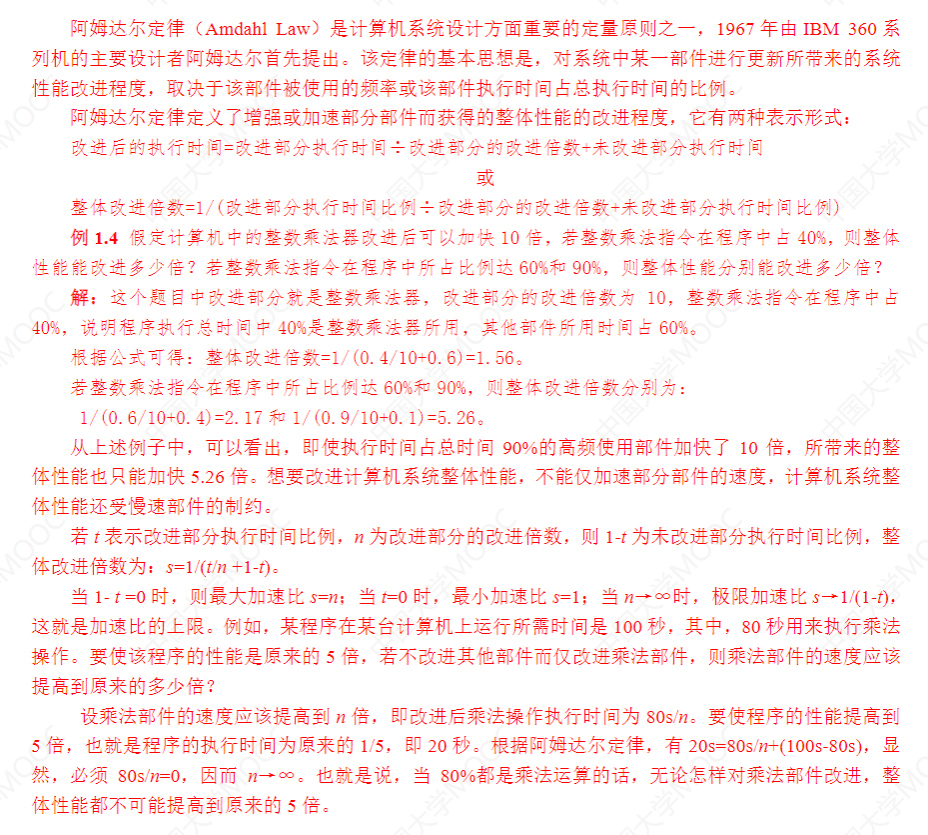

# 计算机系统基础

## 8.30 第一章

比特b：0或1

字节B：8比特（0xFF）

在**intel i386**

字   ： 2个字节

双字：4个字节

#### 小端：

低有效字节在低地址

#### 大端：

低有效字节在高地址

ps：本次pa是以小端方式存储

## 9.5 第一章

计算机系统的性能评价主要考虑的是CPU性能。

### CPU性能

​	-用户CPU时间，即CPU运行用户程序代码的时间

### 时钟周期

​	-计算机执行一条指令需要分为若干个微操作，而为了同步这些微操作的控制信号，计算机必须产生同步的时钟定时信号，即**CPU的主脉冲信号**，其宽度成为时钟周期

​	-时钟频率：CPU的**主频**就是CPU的主脉冲信号的时钟频率，是CPU时钟周期的倒数

### CPI

cycles per instruction

​	-表示执行一条指令所需的时钟周期数。

​	用户CPU时间 = CPI  * 程序总指令条数 * 时间周期

​	两台计算机性能之比即为用户CPU时间之比的倒数

**但是需要注意：用户CPU时间度量公式中的时钟周期、指令条数、CPI三个因素是相互制约的！**

### MIPS

Million Instruction Per Second

平均每秒钟执行多少百万条指令

### 相对MIPS

根据某个公认的参考机型来定义的相应MIPS值，含义是被测机型相对于参考机型MIPS的倍数

----PS：用MIPS对不同的机器进行性能比较有时是不准确甚至不客观的，因为不同机器的指令集不同，不同指令的功能也不同，它们的权重不能一概而论。

### MFLOPS

Million FLOating-point operations Per Second

​	-每秒所执行的浮点运算有多少百万次

### 基准程序

可以通过在不同机器上运行相同的基准程序来比较在不同机器上的运行时间，从而评测其性能。

​	-假如基准测试程序集中不同的程序在两台机器上测试得出的结论不同，可以不同程序的使用频度按照	加权平均的方式计算

​	-也可以将执行时间进行归一化来得到被测试的机器相对于参考机器的性能

​					执行时间的归一化值 = 参考机器上的执行时间 / 被测机器上的执行时间

### Amdahl定律

​	改进后的执行时间

