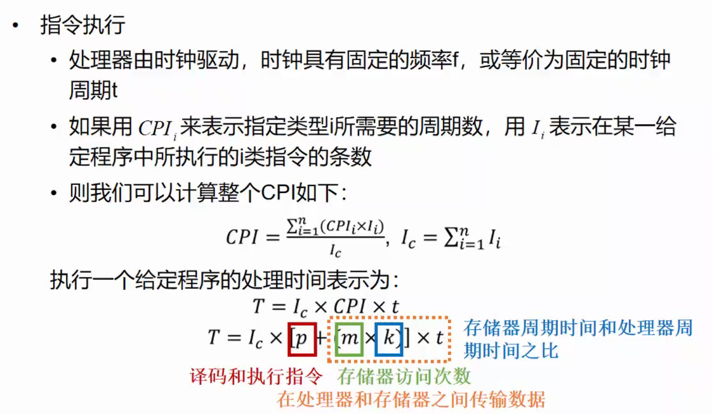

# 计算机组织与结构

## chapter1

### 什么是计算机？

-通用电子数字计算机

-通用：不是一种专用设备，所有计算机在给予足够时间和容量存储器的条件下，都可以完成同样的计算。党希望完成新的计算时，不需要对计算机重新设计

### >计算机系统

-硬件：处理器、存储器、外部设备

-软件：程序、文档

### 组织与结构

组织：对编程人员不可见

结构：对编程人员可见

### 计算机简史

#### 第一代：真空管

ENIAC：第一台通用计算机

EDVAC：采用冯.诺伊曼结构（普林斯顿结构）

​	冯诺依曼结构的三个基本原则：

​		-二进制

​		-存储程序执行

​		-五个组成部分

​			-主存储器：地址和存储的内容（important） 

​			-算数逻辑/处理单元：执行信息的实际处理

​			-程序控制单元：指挥信息的处理

​			-输入设备

​			-输出设备

#### 第二代：晶体管

体积更小、更便宜、发热更少，而且能以与电子管相同的方式建造计算机

使用更复杂的算数逻辑单元和控制器，使用高级编程语言

#### 第三代及后续几代：集成电路

### 计算机发展：变与不变

-

### 计算机性能

> #### CPU性能

-系统时钟

​	-时钟频率/时钟速度（单位：Hz）：计算机执行最基本操作的基本速率（以每秒周期数为单位）

​	-时钟周期/时钟滴答声：CPU的单个电子脉冲

​	-周期时间（单位：s）：两个脉冲之间的时间

​		-有时被称为**时钟周期**

> **但是有时，cpu会专门做一块硬件来处理某条特定的指令，使得这个特定的指令执行的特别快，显得cpu性能很好。为了防止这种以偏概全的作弊方法，并找到一种公平的方法来量化cpu性能我们引入**：

****

所以，有些常见的跑分软件的原理即：拿一堆基准程序来跑

