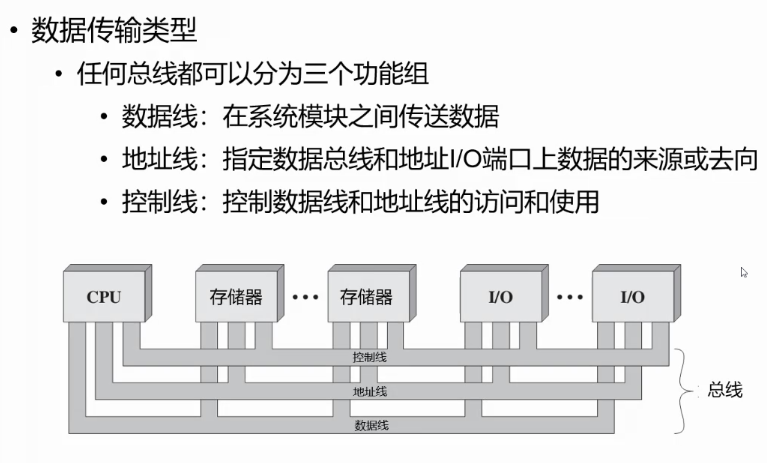
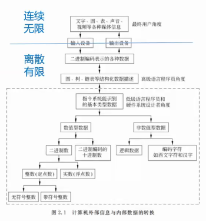
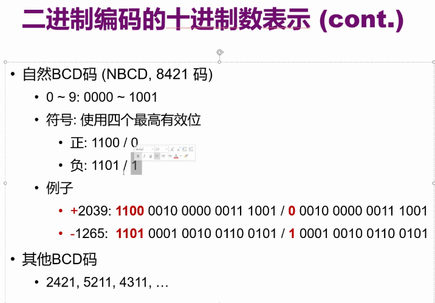

# 计算机组织与结构

## chapter1

### 什么是计算机？

-**通用电子数字计算机**

-通用：不是一种专用设备，所有计算机在给予足够时间和容量存储器的条件下，都可以完成同样的计算。党希望完成新的计算时，不需要对计算机重新设计

### >计算机系统

-硬件：处理器、存储器、外部设备

-软件：程序、文档

### 组织与结构

组织：对编程人员不可见

结构：对编程人员可见

### 计算机简史

#### 第一代：真空管

ENIAC：第一台通用计算机

EDVAC：采用冯.诺伊曼结构（普林斯顿结构）

​	冯诺依曼结构的三个基本原则：

​		-二进制

​		-存储程序执行

​		-五个组成部分

​			-主存储器：地址和存储的内容（important） 

​			-算数逻辑/处理单元：执行信息的实际处理

​			-程序控制单元：指挥信息的处理

​			-输入设备

​			-输出设备

#### 第二代：晶体管

体积更小、更便宜、发热更少，而且能以与电子管相同的方式建造计算机

使用更复杂的算数逻辑单元和控制器，使用高级编程语言

#### 第三代及后续几代：集成电路

#### 摩尔定律

​	-每18个月晶体管的数量增加1倍

### 计算机发展：变与不变

-

### 计算机性能

> #### CPU性能

-系统时钟

​	-时钟频率/时钟速度（单位：Hz）：计算机执行最基本操作的基本速率（以每秒周期数为单位）

​	-时钟周期/时钟滴答声：CPU的单个电子脉冲

​	-周期时间（单位：s）：两个脉冲之间的时间

​		-有时被称为**时钟周期**

> **但是有时，cpu会专门做一块硬件来处理某条特定的指令，使得这个特定的指令执行的特别快，显得cpu性能很好。为了防止这种以偏概全的作弊方法，并找到一种公平的方法来量化cpu性能我们引入**：

****

所以，有些常见的跑分软件的原理即：拿一堆基准程序来跑

$$MIPS = \frac{f}{CPI * 10^6}$$

## chapter2、计算机的顶层视图

### 计算机组件

​	-数据和指令存储在单个读写存储器

​	-该存储器的内容可按位置寻址，而无需考虑其中包含的数据类型

​	-从一条指令到下一条指令以顺序方式执行（除非明确修改）

### CPU

​	PC：程序计数器

​	IR：指令寄存器

​	MAR：存储器地址寄存器

​	MBR：存储器缓冲寄存器

​	I/O AR：I/O地址寄存器

​	I/O BR：I/O缓冲寄存器

​	执行单元

​	-问题：CPU在等待I/O设备时保持空闲

​	-解决方法：

​		-中断：其他模块（例如I/O)可以中断正常处理顺序的机制

​			-在等I/O 的时候中断以下去处理其他的程序，待I/O准备好以后，其打断CPU，让其继续未完成的			操作。

​			-中断程序全部处理完了之后，再回到用户程序，即：中断程序优先级更高

​			

### 存储器

​	问题：

​		-主存和CPU之间传输数据的速度跟不上CPU的速度

​		

​	解决：

​		-添加一级或多级缓存（cache）以减少存储器访问频率并提高数据传输速率（层次式存储结构）

​		-增大总线的数据宽度，来增加每次所能取出的位数

​		-...

​	约束：

​		-容量：越大越好

​		-速度：跟上存储器

​		-成本：相对于其他组件合理	

​		-约束之间的关系：更短的访问时间，更高的每比特成本

### I/O模块

​	-与CPU和内存交换从外部来源收集的数据

​	问题：I/O性能跟不上CPU速度的提升

​	解决：

​		-缓冲

​		-新的接口技术

​		-...

### 系统总线

​	-是连接两个或多个设备的通信通路

## chapter3、数据的机器级表示

### 编码：

​	定义：用少量简单的基本符号对复杂多样的信息进行一定规律的组合。

​	注意：不可能用离散有限的数据准确的表示连续无限的现实变量。

#### 	采用二进制的原因：

​		-多种物理器件可以表示两种稳定的状态，用于表示0和1

​		-二进制的编码和运算规则简单

​		-1和0可以对应逻辑命题中的“真”与“假”

### 数值型数据的二进制数表示：

#### 		整数类型

##### 					无符号整数

##### 					有符号整数：原码，反码，移码，补码

​						-补码的表示：略

​						-补码的解析：$[X]_C = X_nX_{n-1}...X_1 \to X = -X_n * 2^{n-1} + X_{n-1} * 2^{n-2}+...+ X_1 * 2^0$

​				

#### 	浮点数的二进制数表示

​			-基即为2，约定俗称为2.

​			-规格化数的表示范围：

此时计数：小数精度更高是因为，小数的相对偏差更大，精度要求更高。而大数精度要求较小，所以大数的精度可以稍微低一点

IEEE 754规定的舍入标准是**向偶数舍入**？

## chapter4、数据校验码

### 差错

​	-分类

### 纠错

#### 	基本思想：

​		存储额外的信息以进行检错和校正

#### 	处理过程：

​		数据输入：

​				-使用函数$f$在M位数据$D$上生成K位校验码$C$

​		数据输出：

​				-使用函数$f$在M位数据$D^{'}$上生成K位校验码$C^{''}$，并与取出的K位码$C^{'}$（因为此时$C$在				拿出来的时候也可能出错，产生$C^{’}$）进行比较

​		-没有检测到差错：使用数据$D^{'}$

​		-检测到差错且可以校正：校正数据$D^{'}$来生成数据$D^{''}$并用数据$D^{''}$

​		-检测到差错但无法纠正：报告

​		注意：数据在经过存储器/网络时会发生错误，经过存储器/网络后的数据会发生改变！

### 奇偶校验码

#### 	基本思想：

​		增加1位校验码来表示数据中的1的数量是奇数还是偶数

#### 	处理过程

​		假设处理数据$D=D_M...D_2D_1$

​		-使用抑或操作

​			-特点：0跟任何数抑或后还是那个数，因此0对抑或运算没有影响

​							 1和1抑或生成1

​			-因此奇数个1抑或后生成1，偶数个1抑或后生成0

​		-奇校验：奇数个1生成0，偶数个1生成1（和原数据放在一起，1的个数是奇数个）

​		-偶校验：奇数个1生成1，偶数个1生成0（和原数据放在一起，1的个数是偶数个）			 

#### 		校验分析

### 			

总的来说，如果01位数出错了，但总体的奇偶性没变，则无法检测出来

也无法检测出来具体是哪一位出现了错误

而且发现了错误后无法纠正。

我们默认：较短长度（如1字节）的数据每次出错只会1位出错，因此奇偶校验码适用于较短长度（如1字节）的数据进行检错。

### 海明码

#### 		基本思想

​		-将数据分为几组，对每一组都使用奇偶校验码进行检错（可以是有重复的分组）

#### 		处理过程

​		-将M位数据分成K组

​		-数据输入

​			为数据$D$中每组生成1位校验码，合并得到K位校验码$C$

​		-数据输出

​			为数据$D^{'}$中每组生成1位校验码，合并得到新的K位校验码$C^{''}$

​		-检错：

​			将校验码$C^{''}$和取出的校验码$C^{'}$按位进行异或，生成K位故障字（syndrome word）

​	

数据位出错和校验码出错分别有M和K种情形

且我们假设数据出错和校验码出错不会同时发生。

通过设定M，我们可以求出需要K的最小值

#### 故障字的作用：

​	每种取值都反映一种情形（数据出错/校验码出错/未出错）

​	规则：

​		全都是0：没有检测到错误

​		有且仅有1位是1：错误发生在校验码的某一位，不需要校正（我们假设数据和校验码一		起最多只有1位出错）

​		有多位为1：错误发生在数据中的某一位，将$D^{'}$对应数据位取反即可纠正。（得到		$D^{''}$（某一个数据参与且仅参与了多个组）

#### 校验分析

若故障字哪几位数值为1，则对应校验码出错，说明其内有某个数据位出错。找出公共的数据位，即为出错的位

-我们先规定数据位/校验码与故障字的关系，然后由此可以推导出数据位的划分（如何分组）

### 循环冗余校验

​	适用于以流格式存储和传输大量数据

​	用数学函数生成数据和校验码之间的关系

#### 	基本思想

​		假设数据有M位，左移数据K位（右侧补0），并用K+1位生成多项式除它（模2运算）

​		采用K位余数作为校验码

​		把校验码放在数据（不含补的0）后面，一同传输和或传输

#### 	交错

​		如果M+K位内容可以被生成多项式除尽，则没有检测到错误

​		否则，发生错误

### 补充：模2除法

模除的意思是做除法取余数（除完不要结果只要余数）
模x除，说的是除以几取余数。例如模10除就是除10取余，例如100做模十，余数就是0。不过人类一般是用十进制的，计算机用二进制的，所以这里的模x又有用x进制的意思了，例如100模二，结果仍然是0（这里是二进制数字100也就是十进制的4）
计算机模二除用的是异或运算，因为按位异或的结果与除法结果相同。

模2除法的特点就是：每一位除的结果不影响其它位，即不向上一位借位

模2除法原则：1、被除数的首位为1，商为1

​								2、被除数的首位为0，商为0
​    
​								3、模2除法等同于按位异或，要保证每次除完首位都为0，才能进行右移
​    
​								4、计算时每次右移一位，当被除数的位数小于除数，其为余数

​								5、如果右移后，被除数首位为零，就除以全零
